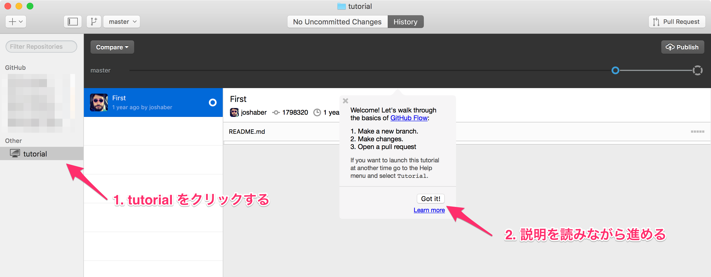

# 情報基礎 2

慶應義塾大学環境情報学部

清水智公 (chiko@tom.sfc.keio.ac.jp)

---

## 今日の内容

* 講義概要
* 開発環境の準備
* GitHubを使う練習

---

## この講義の目的

* 何かを作る経験をすること
* プログラムの基本的な構成要素について学ぶこと
* 問題の把握、分割、解決の方法を学ぶこと

---

##　採点

|成績|基準|
|---|---|
|S|90点以上|
|A|80点以上 |
|B|70点以上、80点未満 |
|C|60点以上、70点未満 |
|D|60点未満|

* 各要素を点数化し、100点満点で採点します
* 中間試験か、最終発表の放棄は採点不可となります

----

### 採点の要素

* 出席
* 中間試験（第8回に予定）
* 最終発表と成果物
* 日々の講義への貢献

----

### 出席について

* 毎回9:30にとります
* 成績に反映されます（上限あり、下限なし）
* ただし出席しているからといって、単位が来るわけではありません

----

### 休講と補講の予定

|日時|内容|メモ|
|---|---|---|
|2017/07/13|休講||
|2017/07/20|休講||
|2017/07/08|補講|2-5限の4コマ行います。最終発表日です|

----

## 担当教員：清水智公

<ul>
<li>しみずのりただ / [@chikoski](https://twitter.com/chikoski)</li>
<li>プログラミング言語、機械学習</li>
<li>サッカー、旅行、音楽、映画とマンガ</li>
</ul>

---

<iframe width="640" height="360" src="https://www.youtube.com/embed/lhlBWlhS7Vg?start=1220&amp;rel=0" frameborder="0" allowfullscreen></iframe>

----

<iframe width="640" height="360" src="https://www.youtube.com/embed/KUB-aJXquUA?start=1117&amp;rel=0" frameborder="0" allowfullscreen></iframe>

---

## 事前準備

* GitHubへのユーザ登録
* ソフトウェアのインストール

----

### ユーザ登録が必要なサービス

* [GitHubのユーザ登録](https://github.com/)
* [CNSのユーザ名との関連づけを行うフォーム](https://docs.google.com/forms/d/e/1FAIpQLSdU9vv5gtqH9YTdWe8PrqxCNP6a31zBnBOHDePrE_OotNuldQ/viewform?usp=sf_link)

----

### インストールするソフトウェア

* [Firefox](https://www.mozilla.org/firefox/)：開発に利用するWebブラウザ
* [Visual Studio Code](https://www.microsoft.com/ja-jp/dev/products/code-vs.aspx):
プログラムを入力するエディタ
* [node.js](https://nodejs.org/)：JavaScriptの処理系
* [GitHub Desktop](https://desktop.github.com/)：GitHubを操作するためのGUIツール

---

## GitHubとは

* ソフトウェア開発プロジェクト用のPaaS
* 代表的な機能
  * Gitを使ったバージョン管理
  * issueトラッキング
  * WiKi
  * Pull Request管理
  * [GitHub Pages](https://pages.github.com/)

----

### バージョン管理とは

* index.html
* index_new.html
* index (old).html
* index_20150920.html
* index_2015092001.html
* index.html（最新）
* index.html（ほんとの最新）

----

### バージョン管理とは（つづき）

* ファイルの変更履歴を管理すること
* 変更履歴：
    * いつ作ったか：ファイルの作成日時
    * いつ変更されたか：ファイルの変更日時
    * 何が変わったのか：ファイルの変更点
    * 誰が変えたのか：ファイルの変更者
* レポジトリ：データの保管場所

----

### GitHubを使うと防げること

* どのファイルが最新のものかわからなくなる
* 二人で同じファイルを編集してしまって、結合時に困る
* ファイルをうっかり消してしまう
* PCが壊れて、データが全てなくなってしまう　

---

## 練習問題1：GitHub Desktop のチュートリアルを実行しよう

---

## 練習問題2：好きな動画を紹介しよう

1. [https://github.com/sfcjs/introduction](https://github.com/sfcjs/introduction) へアクセスします
2. "Fork"と書かれたボタンを押します
3. フォークしたレポジトリをクローンします
4. GitHubのユーザ名.mdというファイルに動画を紹介してください
5. "Send pull-request"というボタンを押してください

---

## じゃんけんで対戦するプログラム

* じゃんけんで対戦相手に勝つためのプログラムを作りましょう
* しばらくはこの教材を利用します
* 対戦相手は何人もいて、それぞれに戦略がことなります
* [デモ](https://sfcjs.github.io/janken/)
* [https://github.com/sfcjs/janken](https://github.com/sfcjs/janken)

----

### レポジトリをフォークしよう

* レポジトリをコピーすることを「フォーク」と呼びます
* [元のレポジトリ](https://github.com/sfcjs/janken)へアクセスします
* "fork" というボタンを押しましょう

----

### フォークしたレポジトリをクローンしよう

1. "Clone or download repository"と書かれたボタンをクリックします
2. GitHub Desktopが起動するので、コピー先のフォルダを選びます

----

### ターミナルでそのフォルダを開こう

1. GitHub Desktopの右にあるメニューから"janken"を探します
2. 見つけた"janken"の上で右クリック（Ctrlを押しながらクリック）します
3. "Open in Terminal"を選びます

----

### 依存するライブラリをインストールします

~~~sh
$ npm install
~~~

* 上記のコマンドを実行すると、依存するライブラリがインストールされます
* node_modulesというフォルダが作成されればokです
* この作業は、最初の1回だけ実行すればokです

----

### サーバの起動

~~~sh
$ npm run serve
~~~

* 上記のコマンドを実行すると、Webサーバが起動します
* [http://localhost:8888/](http://localhost:8888/)にアクセスできるようになります
* アクセスすると、じゃんけんの勝負ができるようになります

----

### サーバの終了

~~~sh
npm run serve

> zyanken@1.0.0 serve /Users/chiko/git/sfcjs/janken
> http-server docs -p 8888 -c-1

Starting up http-server, serving docs
Available on:
  http://127.0.0.1:8888
Hit CTRL-C to stop the server
~~~

* サーバが起動しているターミナルには上記のように表示されています
* Ctrlキーを押しつつ、cを押すと、サーバが終了します

---

## フォルダの構成

* docs：サーバで配信されるファイルが保存されています
* src: ここのファイルを元にdocs/index.jsが作成されます
* package.json：このアプリの情報が記述されています
* yarn.lock：依存ライブラリが列挙されています
* webpack.config.js：docs/index.jsを作成する際に必要となるファイルです

----

### docsフォルダの内容物

* index.html：[http:/localhost:8888/](http:/localhost:8888/)で配信されるHTMLファイル
* index.css：index.htmlで利用するスタイルシート
* index.js：じゃんけんシステムのプログラム
* plyaer.js：自分の手を決めるプログラムを書くファイル

----

### docs/player.jsの初期状態

~~~javascript
function action(){
  return 1;
}
~~~

* `action`の返り値によって出す手が決まります
* 1は「チョキ」を出す、という意味になります

---

## パーを出すプログラムへ変更するには

|返り値|意味|
|-----|---|
|0|グーを出す|
|1|チョキを出す|
|2|パーを出す|

----

### パーを出すプログラムへ変更するには

~~~javascript
function action(){
  return 0;
}
~~~

----

### パーを出すプログラムへ変更するには

~~~javascript
const GU = 0;
const CHOKI = 1;
const PA = 2;

function action(){
  return PA;
}
~~~

---

## 練習問題3：チョキ大好きマンに勝とう

---

## 試合数を覚えておこう

~~~javascript
const GU = 0;
const CHOKI = 1;
const PA = 2;
let matches = 0;

function action(){
  matches = matches + 1;
  return PA;
}
~~~

---

## 数値

~~~javascript
1
-1
3.1415926535
-12345.6789
~~~

* 符号つきの実数
* Number という種類の値
* 32 ビットの浮動小数点

---

## 定数

~~~javascript
const GU = 0;
const CHOKI = 1;
const PA = 2;
~~~

* 値に対して特定の名前をつけること
* 1度しか代入ができません
* 名前は`const`キーワードを使って宣言します

---

## 変数

~~~javascript
let matches = 0;

function action(){
  matches = matches + 1;
  return PA;
}
~~~

* 値につ対して特定の名前をつけること
* 2回以上代入できます
* 名前は`let`キーワードを使って宣言します

---

## 数値演算

|演算子|意味|例|値|
|----|---|--|-|
|\+|足し算|8 + 5|13|
|\-|引き算|8 - 5|3|
|\*|掛け算|8 * 5|40|
|/|割り算|8 / 5|1.6|
|%|割り算のあまり|8 % 5|3|

* 数値と数値の演算を数値演算と呼びます
* 上記の演算子を用いて演算を記述します

----

### 演算子の優先度

|優先度|演算子|結合性|
|-----|----|----|
|19|(…)|n/a|
|14|\* / %|左結合|
|13|\- \+|左結合|

* 大きい優先度を持つものが先に評価されます
* カッコをつけると、その式が先に評価されます
* c.f [演算子の優先度](https://developer.mozilla.org/ja/docs/Web/JavaScript/Reference/Operators/Operator_Precedence)

----

### 複数の演算子が混ざった式

~~~javascript
1 + 2 * 3
(1 + 2) * 3
1 + 2 - 2 * 3 / 3
1 + (2 - 2) * 3 / 3
(1 + (2 - 2)) * 3 / 3
~~~

* 内側のカッコが先に計算されます

----

### 左結合

~~~
1 + 2 + 3
(1 + 2) + 3
~~~

* 同じ優先度の演算が並んでいる場合は、左側のものが先に計算されます
* このことを左結合と言います

---

## 評価

~~~javascript
1 + 2 + 3 + 4
3 + 3 + 4
6 + 4
10
~~~

* 値を決めること
* 式：評価して値が決まるもの

---

### 代入演算子 =

|優先度|演算子|結合性|
|-----|----|----|
|19|(…)|n/a|
|14|\* / %|左結合|
|13|\- \+|左結合|
|3|=|右結合|

* 代入演算子の優先度は低く、ほとんどの演算の後に評価されます
* 評価値は代入された値です
* 代入が並んだ場合、右から順に評価されます

----

### 右結合

~~~javascript
let a, b, c;
a = b = c = 10;
a = b = 10;
a = 10;
~~~

* 右から順に評価されます
* 上記の例では、すべての変数に 10 が代入されます

---

## 練習問題4：交互に出すマンに勝とう

